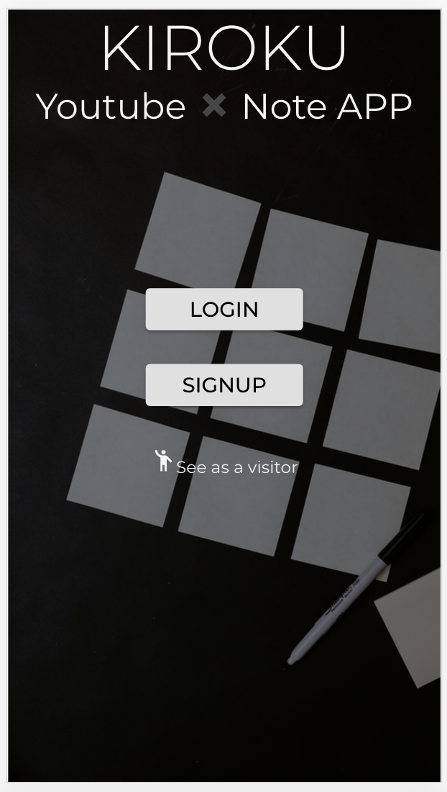
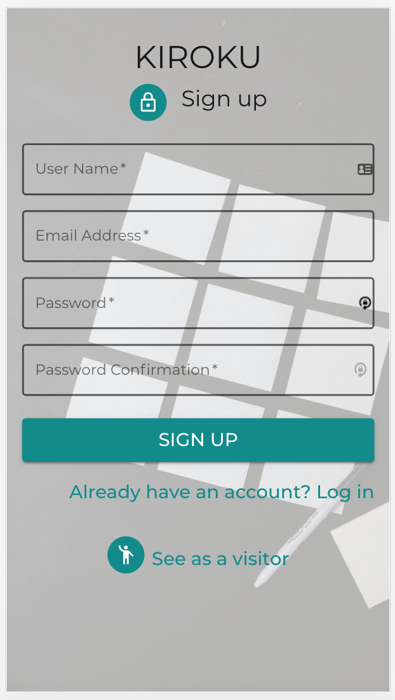
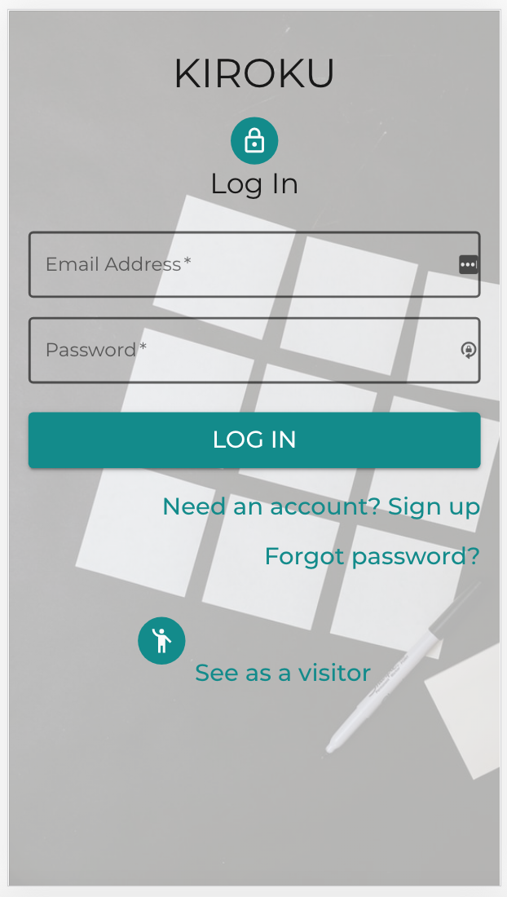

# KIROKU - Note App

## Find youtube tutorial videos and make a note with them!

### Available as mobile app & on desktop size

  <a href="https://kiroku.netlify.app/">
kiroku.netlify.app/
  </a>
 

 React + Firebase (Authentication & Firestore) 
 Project period: 4 weeks  
 API: <a href="https://developers.google.com/youtube/v3">Youtube Data API</a>

### Summary

Are you watching youtube videos for learning programming?
And you want to bookmark them with small notes?
This youtube + note app helps you learn more effectively!

Save videos with notes, like your favorite Youtube channels!
Save useful links for your web development learning journey.

If you login, you can like and create notes!

---

<!-- PROJECT LOGO -->
 

    
    
    

### Search Tutorial Videos / Like your Favorite Channels

| Search programming tutorial youtube videos                            |                 Like /unlike your favorite channels                 |
| --------------------------------------------------------------------- | :-----------------------------------------------------------------: |
|  |  |

### Make Notes with Youtube Link or without

| Make Notes for the tutorial video you liked                           |   You can also create bookmark note   without video but with a link   |
| --------------------------------------------------------------------- | :-----------------------------------------------------------------------: |
|  |  |

---
